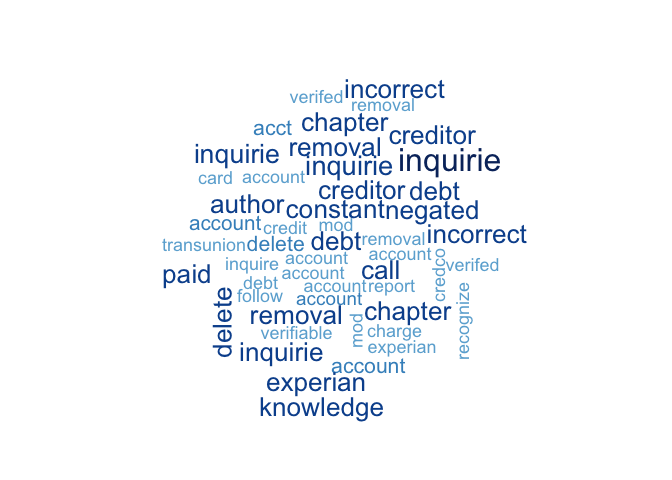
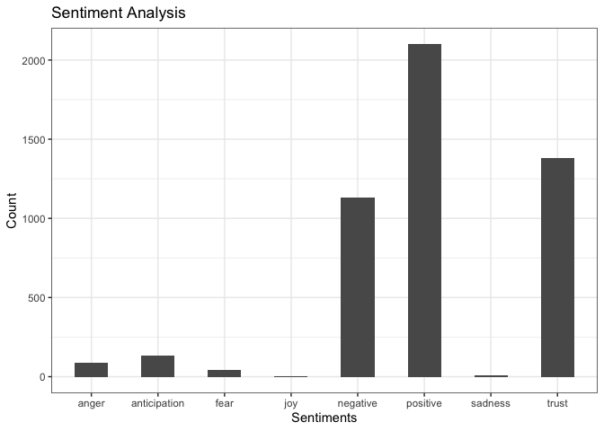

```r
# load libraries ----
library(tidyverse)
library(tm)
library(quanteda)
library(qdap)
library(tidytext)
library(SnowballC)
library(wordcloud)
library(plotrix)
```


```r
# create term-document matrix ----
load("complaints_comp_corpus.RData") # load the corpus

complaints_td <- tidy(TermDocumentMatrix(as.VCorpus(complaints_comp)))
complaints_tf_idf <- complaints_td %>% 
  filter(str_detect(term, "xxxx") == FALSE) %>% 
  bind_tf_idf(term, document, count) %>% 
  arrange(desc(tf_idf))
```


```r
# word cloud ----
set.seed(7)
wordcloud(complaints_tf_idf$term, complaints_tf_idf$tf, max.words = 50, colors = blues9 ,scale=c(2,0.1))
```

<!-- -->


```r
# frequency of words
complaints_cnt <- complaints_tf_idf %>% 
  group_by(term) %>% 
  summarise(
    count = sum(count)
  ) %>% 
  arrange(desc(count))
```


```r
complaints_cnt
```

```
## # A tibble: 8,283 x 2
##    term       count
##    <chr>      <dbl>
##  1 credit     11142
##  2 account    10330
##  3 report      9120
##  4 inform      4787
##  5 payment     4163
##  6 call        4012
##  7 card        3542
##  8 bank        3321
##  9 receivable  3039
## 10 time        2990
## # … with 8,273 more rows
```


```r
set.seed(8)
wordcloud(complaints_cnt$term, complaints_cnt$count, max.words = 50, colors = blues9 ,scale=c(4,0.2))
```

<!-- -->


```r
data <- read_csv("complaints_sentiment.csv")

data %>% 
  filter(sentiment != "1") %>% 
  group_by(sentiment) %>% 
  ggplot(aes(x = sentiment)) +
  geom_bar(width = 0.5) +
  labs(x = "Sentiments", y = "Count", title = "Sentiment Analysis") +
  theme_bw()
```

<!-- -->

